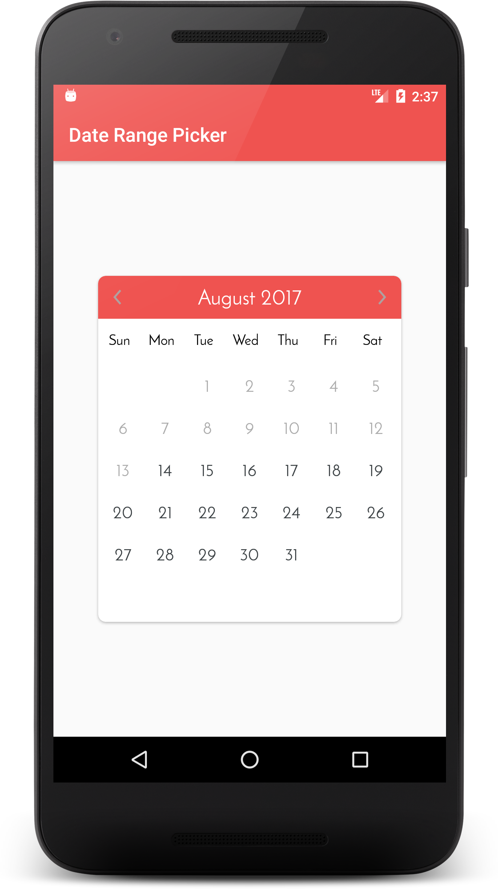

# CalendarDateRangePicker
[  ](https://bintray.com/architshah248/EnticeArc/awesome-calendar/_latestVersion)
 [](https://android-arsenal.com/details/1/6929)
 [](https://github.com/kibotu/Xamarin.Awesome.Calendar)
 [](https://www.nuget.org/packages/Xamarin.Awesome.Calendar/)
 

==================

An Android Library to pick dates range, that helps user to select range from future dates.

**Features:**

- Date selection
- Swipe to change month
- Full customization
- Small in size
- Material design support
- Resolution support
- RTL support

Screenshots
-----------




Developer setup
---------------

**Import DateRangePicker dependency**


For Gradle:

Add following line to App level gradle:
```
dependencies {
    compile 'com.archit.calendar:awesome-calendar:2.0.0'
}
```


For Maven:
```xml
<dependency>
  <groupId>com.archit.calendar</groupId>
  <artifactId>awesome-calendar</artifactId>
  <version>2.0.0</version>
  <type>pom</type>
</dependency>
```

**Usage**
---------------
````xml
<com.archit.calendardaterangepicker.customviews.DateRangeCalendarView
             android:id="@+id/calendar"
             android:layout_width="wrap_content"
             android:layout_height="wrap_content"
             custom:disable_date_color="#ABABAB"
             custom:header_bg="@drawable/calendar_header"
             custom:range_color="@color/range_color"
             custom:selected_date_circle_color="@color/selected_date_circle_color"
             custom:title_color="@color/calendar_header_title">
</com.archit.calendardaterangepicker.customviews.DateRangeCalendarView>
````


**XML Attribute set**
------------------

| Attribute                  | Type      | Desciption                         |
| :------------------------- | --------- | ---------------------------------- |
| title_color                | Color     | Title color                        |
| week_color                 | Color     | Week text color                    |
| range_color                | Color     | Date range color                   |
| selected_date_circle_color | Color     | Selected date text circle color         |
| selected_date_color        | Color     | Selected date text color                |
| default_date_color         | Color     | Default date text color                 |
| range_date_color           | Color     | Date text color when it falls into range |
| disable_date_color         | Color     | Disable date color                 |
| enable_time_selection      | Boolean   | true to enable time selection else false    |
| text_size_title            | Dimension | Title size                         |
| text_size_week             | Dimension | Week text size                     |
| text_size_date             | Dimension | Date text size                     |
| header_bg                  | Drawable  | Header background                  |
| week_offset                | Dimension | To set week start day offset                  |
| editable                   | Boolean   | When true user can edit. By default its value is true               |
| date_selection_mode        | enum      | To set date selection from (FREE_RANGE, SINGLE, FIXED_RANGE)     |


**Set callbacks**
````Java
public interface CalendarListener {
        void onFirstDateSelected(Calendar startDate);
        void onDateRangeSelected(Calendar startDate, Calendar endDate);
}
````
````Java
calendar.setCalendarListener(new CalendarListener() {
    @Override
            public void onFirstDateSelected(Calendar startDate) {
                Toast.makeText(MainActivity.this, "Start Date: " + startDate.getTime().toString(), Toast.LENGTH_SHORT).show();
            }

            @Override
            public void onDateRangeSelected(Calendar startDate, Calendar endDate) {
                Toast.makeText(MainActivity.this, "Start Date: " + startDate.getTime().toString() + " End date: " + endDate.getTime().toString(), Toast.LENGTH_SHORT).show();
            }
});
````

**Set selectable date range(To enable/disable past or future dates)**
````Java
calendar.setSelectableDateRange(startDateSelectable, endDateSelectable);
````

**Set selected date range**
````Java
calendar.setSelectedDateRange(startDate, endDate);
`````

**Reset calendar date selection**
````Java
calendar.resetAllSelectedViews();
`````

**Set navigation arrow left-right image**
````Java
calendar.setNavLeftImage(ContextCompat.getDrawable(this,R.drawable.ic_left));
calendar.setNavRightImage(ContextCompat.getDrawable(this,R.drawable.ic_right));
`````

**Set text fonts**
````Java
Typeface typeface = Typeface.createFromAsset(getAssets(), "Roboto.ttf");
calendar.setFonts(typeface);
`````

**Set week offset ( 0-Sun, 1-Mon, 2-Tue, 3-Wed, 4-Thu, 5-Fri, 6-Sat )**
````Java
calendar.setWeekOffset(1);
`````

**Set current visible month on calendar**
````java
Calendar current = Calendar.getInstance();
calendar.setCurrentMonth(current);
````

**Set calendar months range**
````Java
Calendar startMonth = Calendar.getInstance();
startMonth.add(Calendar.MONTH, -2);
Calendar endMonth = (Calendar) now.clone();
endMonth.add(Calendar.MONTH, 5);

calendar.setVisibleMonthRange(startMonth,endMonth);
````

**Set pre selected dates**
````Java
Calendar startSelectionDate = Calendar.getInstance();
startSelectionDate.add(Calendar.MONTH, -1);
Calendar endSelectionDate = (Calendar) startSelectionDate.clone();
endSelectionDate.add(Calendar.DATE, 40);

calendar.setSelectedDateRange(startSelectionDate, endSelectionDate);
````

**Set days selection (only for FIXED_RANGE)**
````Java
calendar.setFixedDaysSelection(6);
````

### Xamarin
You can add this into your xamarin project from below link<br/>
[How to add Xamarin.Awesome.Calendar into xamarin project](https://www.nuget.org/packages/Xamarin.Awesome.Calendar)
 

### Special Thanks to contributors:
- [Kibotu](https://github.com/kibotu)
- [FahanBakht](https://github.com/FahanBakht)
 
 
### Please help me in making it best by reporting issue or posting any feature extension.

### Requirements

- Java 8, Kotlin
- Latest version of Android SDK and Android Build Tools


License
-------

    Copyright 2020 Archit Shah

    Licensed under the Apache License, Version 2.0 (the "License");
    you may not use this file except in compliance with the License.
    You may obtain a copy of the License at
    
       http://www.apache.org/licenses/LICENSE-2.0
    
    Unless required by applicable law or agreed to in writing, software
    distributed under the License is distributed on an "AS IS" BASIS,
    WITHOUT WARRANTIES OR CONDITIONS OF ANY KIND, either express or implied.
    See the License for the specific language governing permissions and
    limitations under the License.

