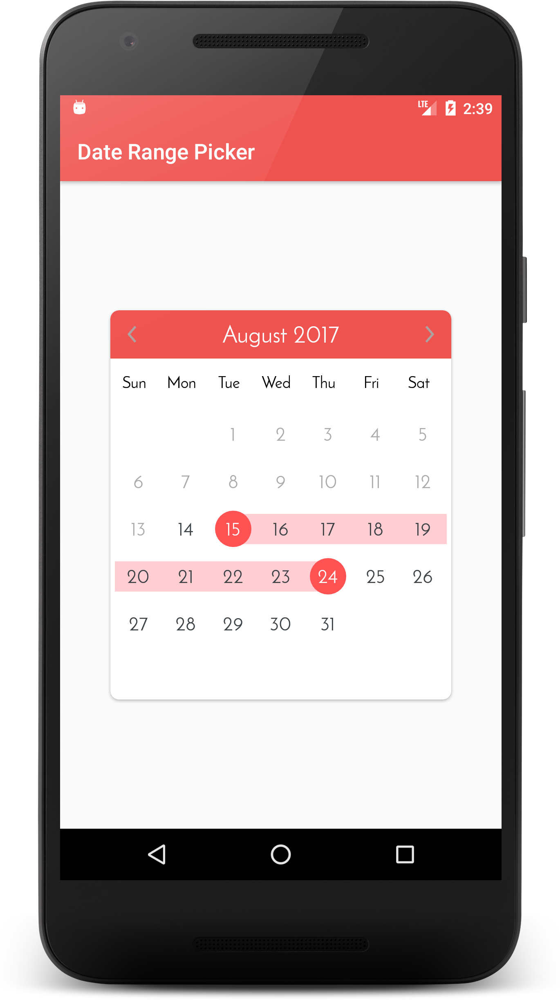

# CalendarDateRangePicker
==================

An Android Library to pick dates range, that helps user to select range from future dates.

**Features:**

- Date selection
- Full customization
- Small in size
- Material design support
- Resolution support

Screenshots
-----------





Developer setup
---------------

**Import DateRangePicker dependency**


For Gradle:

Add following line to App level gradle:
```
dependencies {
    compile 'com.archit.calendar:awesome-calendar:1.0.1'
}
```


For Maven:
```xml
<dependency>
  <groupId>com.archit.calendar</groupId>
  <artifactId>awesome-calendar</artifactId>
  <version>1.0.1</version>
  <type>pom</type>
</dependency>
```

**Usage**
---------------
````xml
<com.archit.calendardaterangepicker.customviews.DateRangeCalendarView
             android:id="@+id/calendar"
             android:layout_width="wrap_content"
             android:layout_height="wrap_content"
             custom:disable_date_color="#ABABAB"
             custom:header_bg="@drawable/calendar_header"
             custom:range_color="@color/range_color"
             custom:selected_date_circle_color="@color/selected_date_circle_color"
             custom:title_color="@color/calendar_header_title">
</com.archit.calendardaterangepicker.customviews.DateRangeCalendarView>
````


**XML Attribute set**
------------------

| Attribute                  | Type      | Desciption                         |
| :------------------------- | --------- | ---------------------------------- |
| title_color                | Color     | Title color                        |
| week_color                 | Color     | Week text color                    |
| range_color                | Color     | Date range color                   |
| selected_date_circle_color | Color     | Selected date circle color         |
| selected_date_color        | Color     | Selected date color                |
| default_date_color         | Color     | Default date color                 |
| range_date_color           | Color     | Date color when it fall into range |
| disable_date_color         | Color     | Disable date color                 |
| enable_time_selection      | Boolean   | true for enable time else false    |
| text_size_title            | Dimension | title size                         |
| text_size_week             | Dimension | week text size                     |
| text_size_date             | Dimension | date text size                     |
| header_bg                  | Drawable  | header background                  |


### Requirements

- Java 8
- Latest version of Android SDK and Android Build Tools


License
-------

    Copyright 2017 Archit Shah

    Licensed under the Apache License, Version 2.0 (the "License");
    you may not use this file except in compliance with the License.
    You may obtain a copy of the License at
    
       http://www.apache.org/licenses/LICENSE-2.0
    
    Unless required by applicable law or agreed to in writing, software
    distributed under the License is distributed on an "AS IS" BASIS,
    WITHOUT WARRANTIES OR CONDITIONS OF ANY KIND, either express or implied.
    See the License for the specific language governing permissions and
    limitations under the License.

